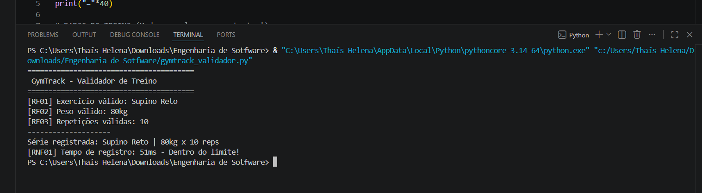
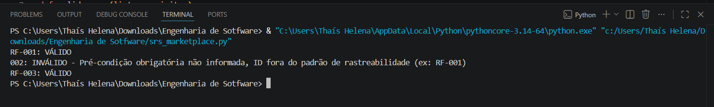
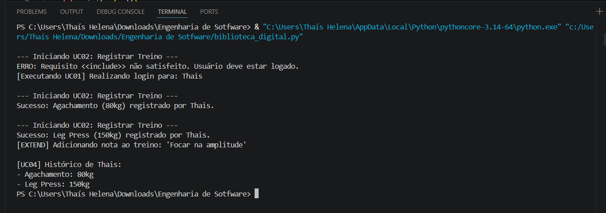
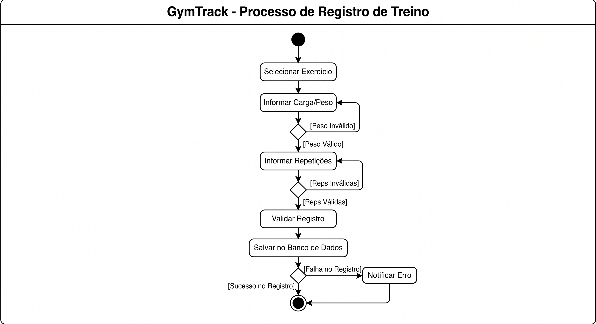
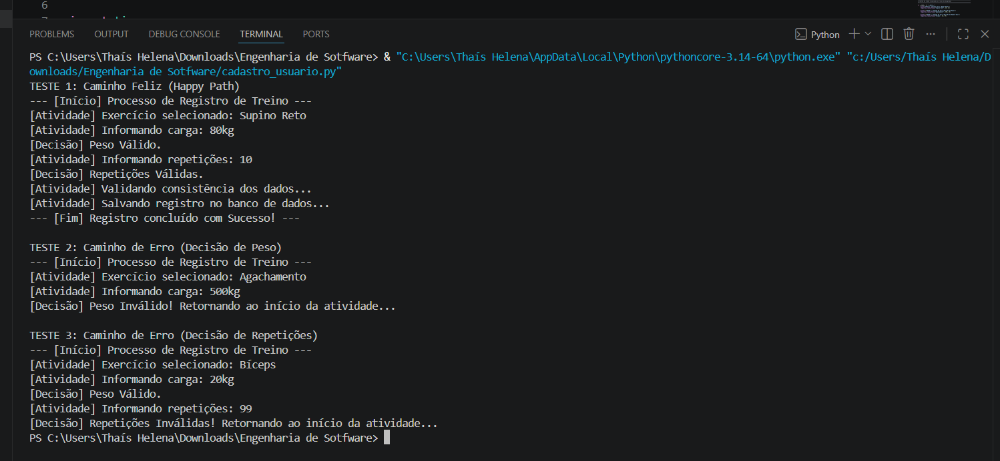
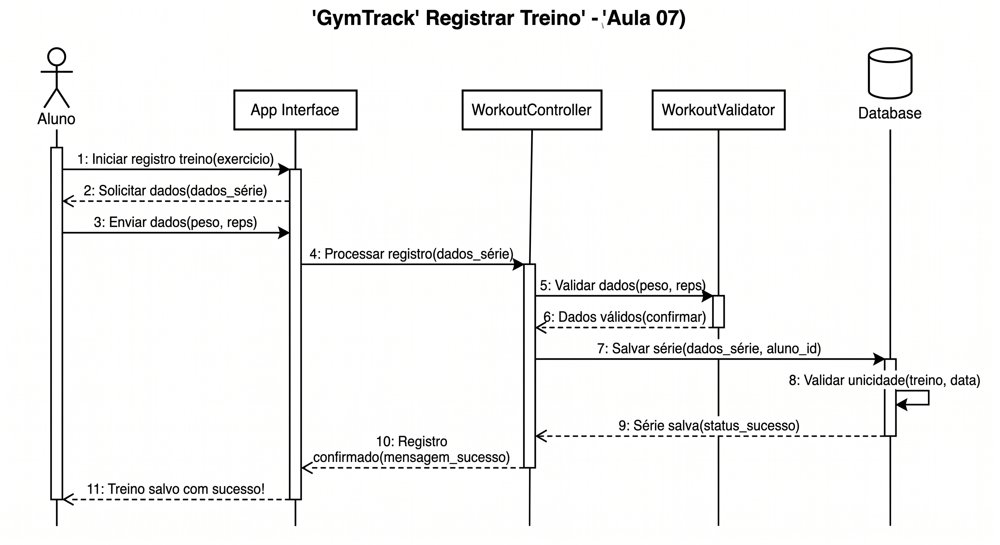
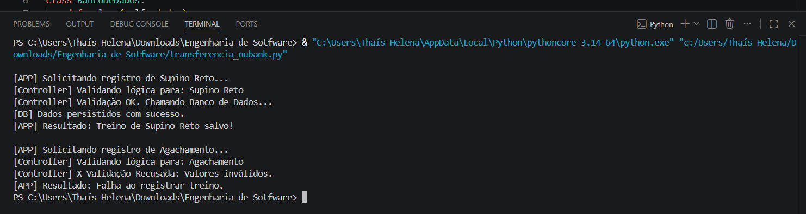
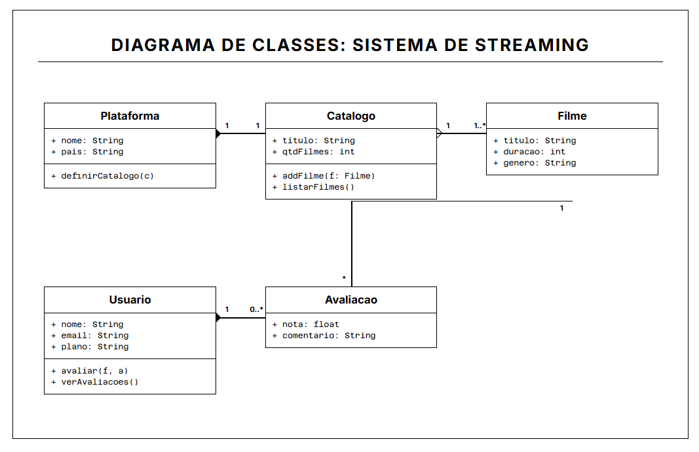
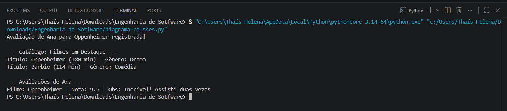

# 📁 Portfólio — Engenharia de Software | FIAP 2026

## Sobre este repositório

Portfólio individual desenvolvido ao longo do semestre na disciplina de **Engenharia de Software** — Engenharia de Computação 3º Ano | FIAP.  
Cada pasta corresponde a uma aula e contém os exercícios práticos realizados: diagramas UML, códigos Python e prints de execução.

**Aluna:** Thaís Helena  
**Prof:** Hercules Ramos  
**Checkpoint:** CP3

---

## Como executar os exercícios

### Pré-requisitos

- Python 3.10+
- Nenhuma biblioteca externa necessária (apenas módulos padrão da linguagem)
- Figma

### Instalação

```bash
# Clone o repositório
git clone https://github.com/thiiss/Engenharia-de-Software.git
cd Engenharia-de-Software

# Execute qualquer arquivo diretamente
python aula-03-requisitos/gymtrack_validador.py
```

---

## Exercícios por Aula

---

### Aula 03 — Requisitos Funcionais vs. Não-Funcionais

#### 💻 Código

Arquivo: [`aula-03-requisitos/gymtrack_validador.py`](aula-03-requisitos/gymtrack_validador.py)

> O código implementa o **GymTrack**, um validador de treino que aplica requisitos funcionais (validar nome do exercício, peso entre 1–300kg, repetições entre 1–50) e não-funcionais (tempo de registro abaixo de 200ms). Cada validação é identificada com seu código RF ou RNF, conectando diretamente o código ao documento de requisitos.

#### 🖥️ Execução



> O terminal exibe as validações em sequência: exercício válido, peso dentro do limite, repetições aceitas e tempo de resposta dentro do requisito não-funcional de 200ms.

---

### Aula 04 — Documento SRS

#### 💻 Código

Arquivo: [`aula-04-srs/srs_marketplace.py`](aula-04-srs/srs_marketplace.py)

> O código modela um **SRS (Software Requirements Specification)** do FIAP Marketplace usando `dataclasses` e `Enum`. Implementa as classes `RequisitoFuncional`, `RequisitoNaoFuncional` e `SRS` com métodos para adicionar requisitos e gerar um relatório formatado, seguindo o padrão IEEE 830 com ID, descrição, prioridade, ator, pré e pós-condição.

#### 🖥️ Execução



> O relatório exibe os requisitos funcionais (cadastro de produto, busca por categoria, checkout) e não-funcionais (disponibilidade 99,9% e conformidade LGPD) do FIAP Marketplace.

---

### Aula 05 — UML e Diagramas de Casos de Uso

#### 🗺️ Diagrama


> O diagrama modela o **Sistema de Biblioteca Digital** com os atores Leitor, Bibliotecário e Sistema de Pagamento. Inclui os relacionamentos `<<include>>` (Emprestar Livro → Verificar Disponibilidade) e `<<extend>>` (Devolver Livro → Aplicar Multa), com a fronteira do sistema claramente delimitada.

#### 💻 Código

Arquivo: [`aula-05-casos-de-uso/biblioteca_digital.py`](aula-05-casos-de-uso/biblioteca_digital.py)

> Implementa os casos de uso do diagrama em Python usando listas e dicionários: UC-01 Listar Catálogo, UC-02 Buscar Livro, UC-03 Emprestar Livro (com verificação de disponibilidade como `<<include>>`) e UC-04 Devolver Livro (com aplicação de multa como `<<extend>>`). Cada bloco de código corresponde diretamente a um caso de uso modelado no Miro.

#### 🖥️ Execução



> O terminal exibe o catálogo inicial, a busca por "clean", o empréstimo bem-sucedido e o estado final após a devolução — cobrindo os fluxos principal e alternativo do diagrama.

---

### Aula 06 — Diagramas de Atividades

#### 🗺️ Diagrama



> O diagrama modela o fluxo de **Cadastro e Aprovação de Usuário** com swimlanes divididas entre Usuário e Sistema. Contém nó inicial, nó final, duas decisões (`[e-mail válido?]` e `[já cadastrado?]`), atividades rotuladas e transições identificadas — criado no Miro e exportado em PNG.

#### 💻 Código

Arquivo: [`aula-06-atividades/cadastro_usuario.py`](aula-06-atividades/cadastro_usuario.py)

> Implementa o fluxo do diagrama em Python: valida o formato do e-mail, verifica duplicidade no cadastro, cria a conta, envia confirmação e libera ou expira o acesso. Cada `if` no código corresponde a uma decisão do diagrama de atividades, tornando a relação entre diagrama e código direta e rastreável.

#### 🖥️ Execução



> O terminal exibe três cenários: cadastro bem-sucedido, e-mail inválido e e-mail já existente — cobrindo o fluxo principal e os dois fluxos alternativos modelados no diagrama.

---

### Aula 07 — Diagramas de Sequência

#### 🗺️ Diagrama



> O diagrama modela o fluxo de **Transferência no App Nubank** com quatro participantes: Usuário, App Nubank, Servidor Nubank e Banco de Dados. Inclui lifelines, barras de ativação, mensagens síncronas e o fragmento `[alt]` para tratar saldo suficiente vs. saldo insuficiente.

#### 💻 Código

Arquivo: [`aula-07-sequencia/transferencia_nubank.py`](aula-07-sequencia/transferencia_nubank.py)

> Cada classe Python representa um participante do diagrama: `BancoDeDados` verifica saldo e debita, `ServidorNubank` processa a transferência implementando o fragmento `[alt]`, e `AppNubank` inicia a operação e exibe o feedback ao usuário. Os métodos mapeiam diretamente as mensagens do diagrama de sequência.

#### 🖥️ Execução



> O terminal exibe três testes: transferência aprovada com saldo atualizado, transferência recusada por saldo insuficiente e múltiplas transferências consecutivas — validando o fragmento `[alt]` do diagrama.

---

### Aula 08 — Diagramas de Classes

#### 🗺️ Diagrama



> O diagrama modela o **Sistema de Streaming** com as classes `Plataforma`, `Catalogo`, `Filme`, `Usuario` e `Avaliacao`. Os relacionamentos aplicados foram: Composição (Plataforma ◆ Catálogo), Agregação (Catálogo ◇ Filme) e Associação (Usuário → Avaliação → Filme) — a decisão de usar Composição para Catálogo se deve ao fato de ele não existir sem a Plataforma.

#### 💻 Código

Arquivo: [`aula-08-classes/streming_netflix.py`](aula-08-classes/streming_netflix.py)

> Implementa todas as classes do diagrama em Python com OOP. Os relacionamentos se traduzem diretamente no código: Composição via instanciação interna, Agregação via lista de objetos externos e Associação via referência. Inclui os métodos `add_filme`, `listar_filmes`, `avaliar` e `ver_avaliacoes`.

#### 🖥️ Execução



> O terminal exibe a criação da plataforma Netflix, adição de filmes ao catálogo, avaliação de um filme pelo usuário e a listagem final do catálogo com todos os status.

---

### Aula 09 — Arquitetura MVC

#### 🗺️ Diagrama MVC


> O diagrama modela a arquitetura do **To-Do List** em três camadas (Apresentação, Negócio, Dados) com o padrão MVC aplicado. O Model representa a lista de tarefas com título e status (feito/pendente), a View exibe a tela principal e o modal de adicionar tarefa, e o Controller coordena as ações de adicionar, marcar como feita e excluir.

#### 🗺️ Protótipo Figma


> Protótipo mobile (390x844px) com duas telas conectadas via prototype links: `View_ListaTarefas` com lista de tarefas e botão "+" e `View_AdicionarTarefa` com campo de texto e botão salvar. Os layers foram nomeados seguindo a nomenclatura MVC conforme instrução da aula.

---

## Links

- 🔗 [Repositório GitHub](https://github.com/SEU-USUARIO/Engenharia-de-Software)


git commit -m "feat: adiciona validador de treino GymTrack (aula 03)"
